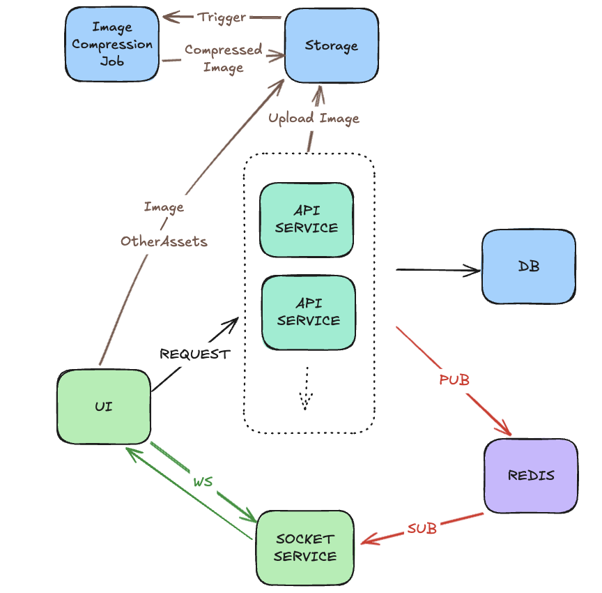

# Instasync

This project is a monorepo managed by pnpm workspace,
designed for efficient development and deployment of interconnected applications and shared libraries.

`apps` folder houses the web applications, including the client-side React app and server-side Express services.

`packages` folder contains reusable libraries and utilities that can be shared across multiple applications within the monorepo.

## Apps

### Client

- React
- TypeScript
- zustand
- react-query
- TailwindCSS

### API Service and Websocket Service

- Express
- TypeScript
- Prisma
- JWT

## Packages

- BulletJS
- Shared Utils
- UI
  - shadcn/ui
  - TailwindCSS
- Typescript Config

## GCP Services

- Cloud Run (Deploy By Containers)
- Cloud Run Function (Image Compression)
- Cloud Storage (Static Assets)
- Cloud SQL (Postgres)
- Cloud Memorystore (Redis)

## Architecture Diagram

